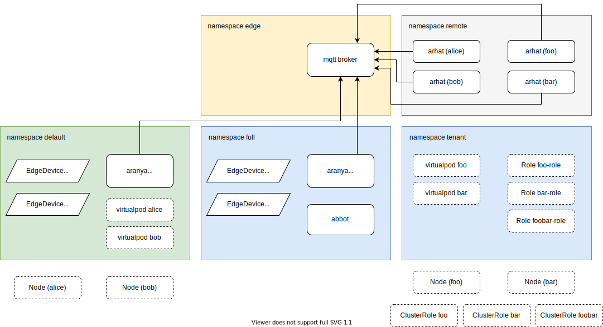

# Testing

## E2E Tests

Environment setup:



### Run

1. Prepare a local image registry in container, name of the container MUST be `kind-registry` and published port MUST be `5000`

   ```bash
   make e2e.image.registry
   ```

1. Build and push test image to local image registry

   ```bash
   export IMAGE_REPOS="localhost:5000"
   export MANIFEST_TAG="e2e"

   make image.build.aranya.linux.test
   make image.push.aranya.linux.test
   ```

1. Run e2e test suite against specific Kubernetes version (version format: `v{MAJOR}-{MINOR}`), by default, it will tear down the kind cluster after the test, to keep the cluster, set environment variable `ARANYA_E2E_CLEAN=0`

   ```bash
   make e2e.v1-14
   ```
