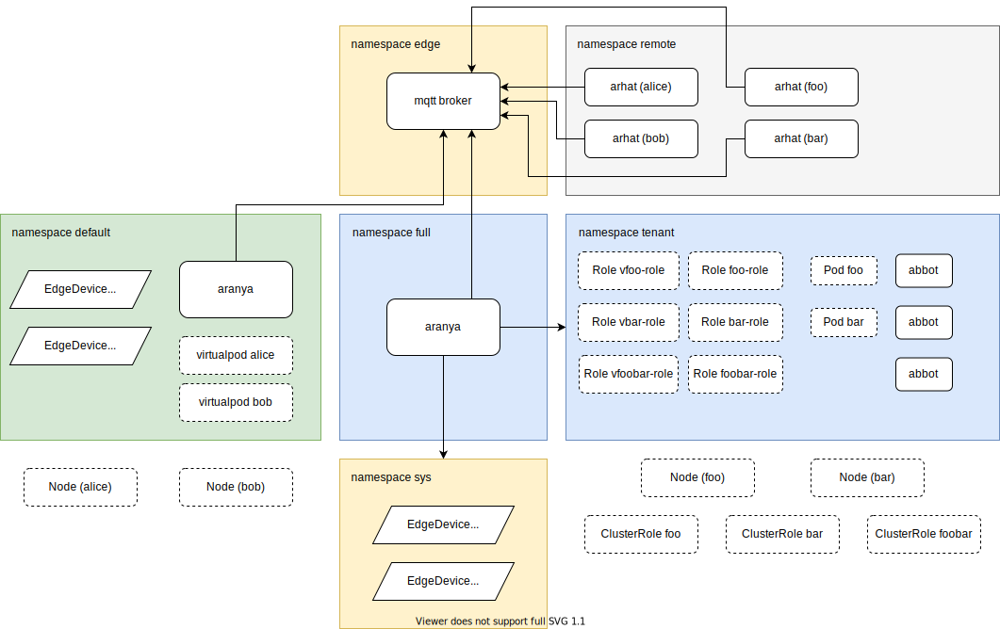

# Testing

## E2E Tests

Environment setup:

Networking in kind is currently buggy especially in the case of multi-node cluster, so we are using custom network plugins

- For Kubernetes v1.15-, using flannel vxlan mode due to lack of CRDv1 support
- For Kubernetes v1.16+, use calico BGP mode
